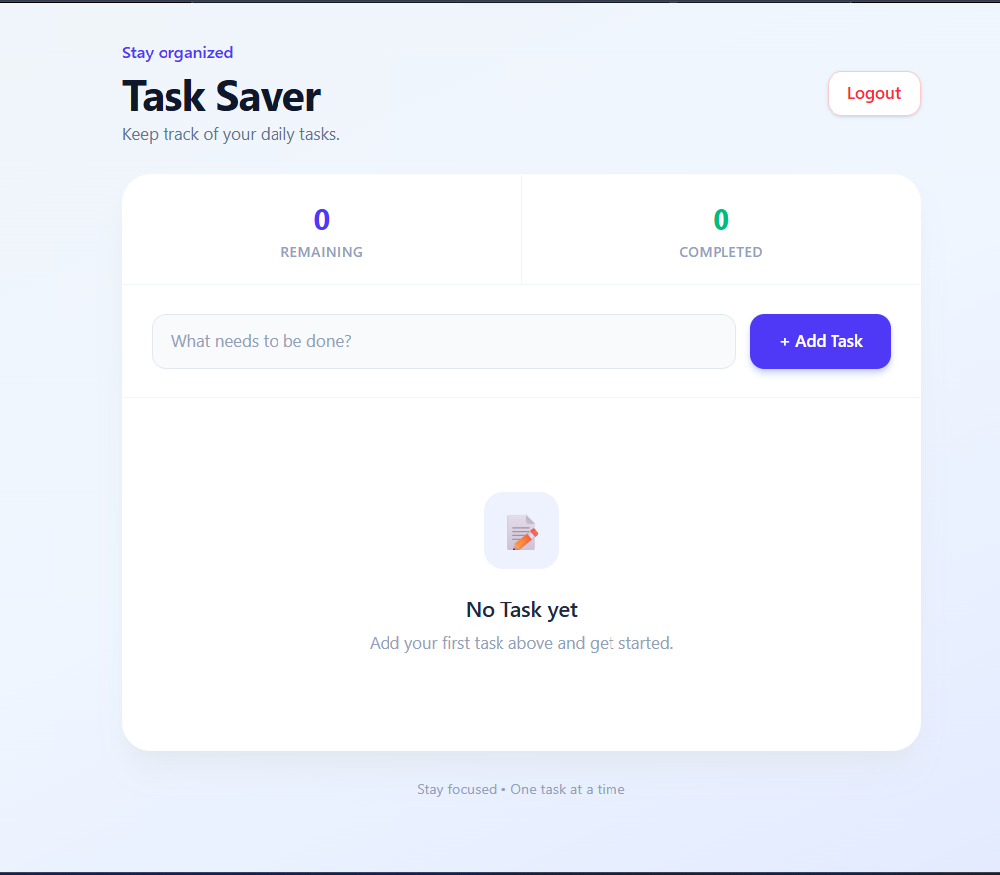
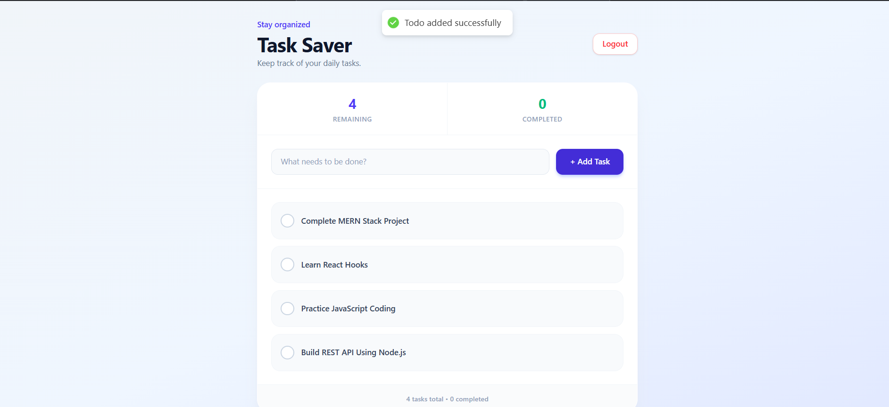
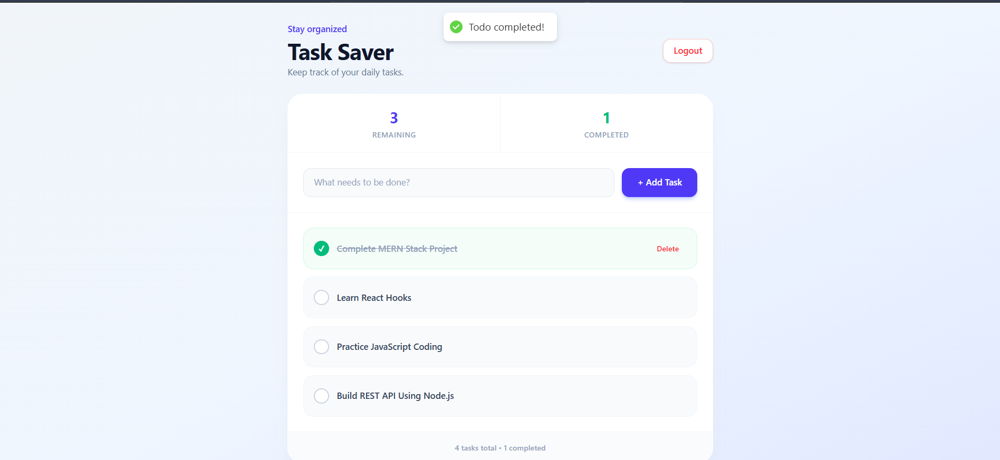
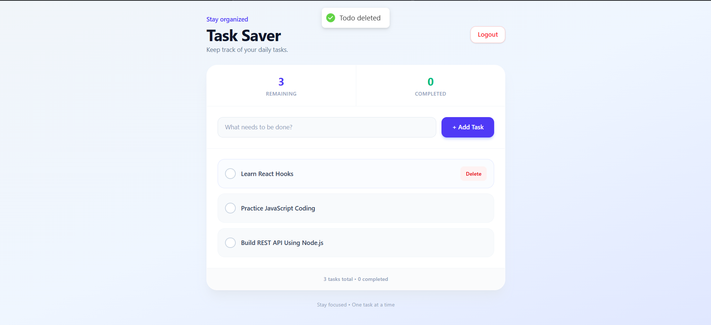
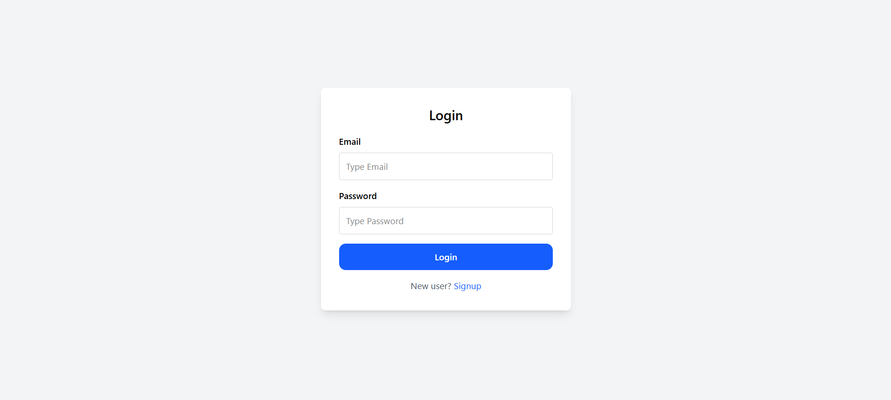
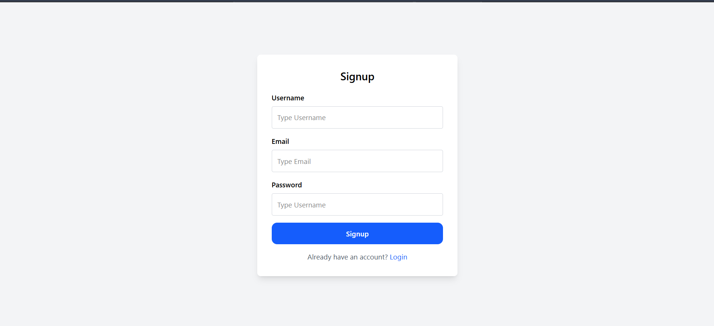

# 📝 Task Saver - MERN Stack Todo Application

Task Saver is a full-stack MERN application that helps users manage their daily tasks. Users can register, log in, create tasks, mark tasks as completed, and delete tasks.

## 🚀 Live Demo

- **Frontend:** [Task Saver](https://task-saver-six.vercel.app/)
- **Backend:** [Task Saver API](https://task-saver.onrender.com)

## 📸 Screenshots

### 1. Dashboard



### 2. Add Task



### 3. Completed Tasks



### 4. Deleted Tasks



### 5. Login Page



### 6. Signup Page



## ✨ Features

- User Registration and Login
- JWT Authentication
- Secure User Authentication
- Protected Routes
- Add New Tasks
- Update Existing Tasks
- Mark Tasks as Completed
- Delete Tasks
- View Remaining and Completed Tasks
- User-specific Task Management
- Responsive User Interface

## 🛠️ Technologies Used

### Frontend
- React.js
- Vite
- Tailwind CSS
- Axios
- React Router
- JavaScript

### Backend
- Node.js
- Express.js
- MongoDB
- Mongoose
- JSON Web Token (JWT)
- Zod

### Deployment
- Vercel (Frontend)
- Render (Backend)
- MongoDB Atlas (Database)

## 📂 Project Structure

```text
task-saver/
│
├── backend/
│   ├── controller/
│   ├── model/
│   ├── routes/
│   ├── middleware/
│   ├── jwt/
│   ├── package.json
│   └── index.js
│
├── frontend/
│   ├── public/
│   ├── src/
│   ├── package.json
│   └── README.md
│
├── screenshots/
│   ├── dashboard.png
│   ├── add-task.png
│   ├── completed-tasks.png
│   ├── deleted-tasks.png
│   ├── login.png
│   └── signup.png
│
└── README.md
```

*Note: The folder structure is a simplified overview of the project.*

## ⚙️ Installation and Setup

Follow these steps to run the project locally.

### 1. Clone the Repository

```bash
git clone https://github.com/SurajPatil-Tech/task-saver.git
```

### 2. Navigate to the Project Folder

```bash
cd task-saver
```

### 3. Backend Setup

Navigate to the backend folder:

```bash
cd backend
```

Install the dependencies:

```bash
npm install
```

Create a `.env` file inside the backend folder and configure the following variables:

```env
MONGO_URI=your_mongodb_connection_string
JWT_SECRET_KEY=your_jwt_secret
FRONTEND_URL=http://localhost:5173
PORT=5000
```

Start the backend server:

```bash
npm start
```

### 4. Frontend Setup

Open a new terminal and navigate to the frontend folder:

```bash
cd task-saver/frontend
```

Install the dependencies:

```bash
npm install
```

Create a `.env` file inside the frontend folder:

```env
VITE_API_URL=http://localhost:5000
```

Start the frontend development server:

```bash
npm run dev
```

Open the local URL displayed in your terminal.

## 🔐 Environment Variables

### Backend

| Variable | Description |
|---|---|
| `MONGO_URI` | MongoDB connection string |
| `JWT_SECRET_KEY` | Secret key used for JWT authentication |
| `FRONTEND_URL` | Frontend URL allowed by the backend |
| `PORT` | Port used by the backend server |

### Frontend

| Variable | Description |
|---|---|
| `VITE_API_URL` | Backend API base URL |

**Important:** Never commit your `.env` files or expose your database credentials or JWT secret.

## 🌐 Deployment

The application is deployed using:

- **Frontend:** Vercel
- **Backend:** Render
- **Database:** MongoDB Atlas

The backend's free Render instance may take some time to respond after a period of inactivity.

## 👨‍💻 Author

**Suraj Patil**

- GitHub: [SurajPatil-Tech](https://github.com/SurajPatil-Tech)
- LinkedIn: [Suraj Patil](https://www.linkedin.com/in/surajpatil-tech)

---